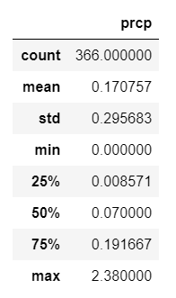
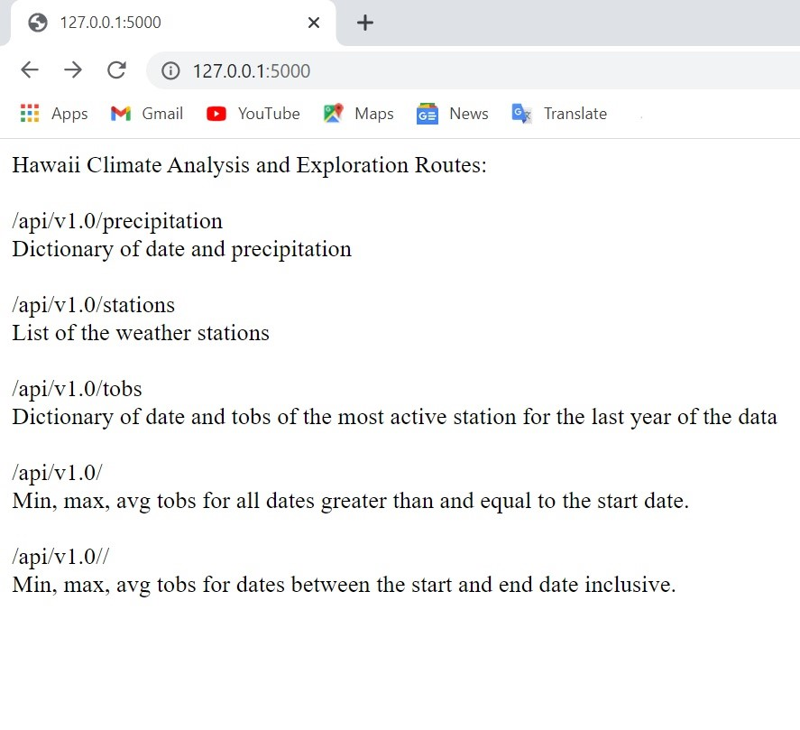

# sqlalchemy-challenge

Use Python and SQLALchemy to analyze and explore climate database

### Purpose

The main purpose of this assignment is to do a basic climate analysis and data exploration using SQLAlchemy ORM queries, Pandas, and Matplotlib.Using SQLAlchemy `create_engine` to connect to [hawaii.sqlite](Resources/hawaii.sqlite) database and to use SQLAlchemy `automap_base()` to reflect the tables into classes. Finally to save a reference to those classes called `Station` and `Measurement`.

### Precipitation Analysis

A query was designed to retrieve the last 12 months of precipitation data and only the `date` and `prcp` values were selected. The query results were then loaded into a Pandas DataFrame with the date column set as index. The DataFrame was then sorted by `date` and finally a plot was made using the DataFrame `plot` method.

And here is the summary statistics for the precipitation data.

### Station Analysis

A query was designed to calculate the total number of stations and to find the most active stations. For this the stations and observation counts were listed in descending order and functions such as `fun.min`, `func.max`, `func.avg`, and `func.count` were used in the queries. 

A query to retrieve the last 12 months of temperature observation data was also designed filtered by the station with the highest number of observations. A plot of the results as a histogram with `bins=12` is as follows:

### Climate App

After the completion of the initial analysis, a Flask API app was designed based on the queries. The following routes were created :

##### Routes

* `/`
 * Home page.
 * List of all routes that were available.

* `/api/v1.0/precipitation`
 * the query results were converted to a dictionary using `date` as the key and `prcp    as the value.
 * Returned the JSON representation of your dictionary

* `/api/v1.0/stations`
 * Returned a JSON list of stations from the dataset.

* `/api/v1.0/tobs`
 * Queried the dates and temperature observations of the most active station for the last year of data.
 * Return a JSON list of temperature observations (TOBS) for the previous year.

* `/api/v1.0/<start>` and `/api/v1.0/<start>/<end>`
 * Returned a JSON list of the minimum temperature, the average temperature, and the max temperature for a given start or start-end range.
 * When given the start only, calculated `TMIN`, `TAVG`, and `TMAX` for all dates greater than and equal to the start date.
 * When given the start and the end date, calculated `TMIN`, `TAVG`, and `TMAX` for all dates greater than and equal to the start date.

 The following is the result :

##### Home page
 
 

##### Precipitation page

