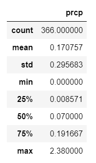

# sqlalchemy-challenge

Use Python and SQLALchemy to analyze and explore climate database

### Purpose

The main purpose of this assignment is to do a basic climate analysis and data exploration using SQLAlchemy ORM queries, Pandas, and Matplotlib.Using SQLAlchemy `create_engine` to connect to [hawaii.sqlite](Resources/hawaii.sqlite) database and to use SQLAlchemy `automap_base()` to reflect the tables into classes. Finally to save a reference to those classes called `Station` and `Measurement`.

### Precipitation Analysis

A query was designed to retrieve the last 12 months of precipitation data and only the `date` and `prcp` values were selected. The query results were then loaded into a Pandas DataFrame with the date column set as index. The DataFrame was then sorted by `date` and finally a plot was made using the DataFrame `plot` method.

And here is the summary statistics for the precipitation data.

### Station Analysis

A query was designed to calculate the total number of stations and to find the most active stations. For this the stations and observation counts were listed in descending order and functions such as `fun.min`, `func.max`, `func.avg`, and `func.count` were used in the queries. 

A query to retrieve the last 12 months of temperature observation data was also designed filtered by the station with the highest number of observations. A plot of the results as a histogram with `bins=12` is as follows:

